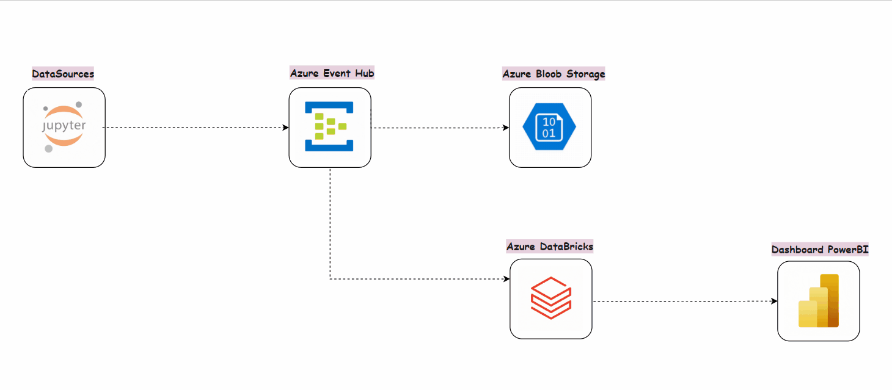

# Projet de Pipeline de Données en Temps Réel

Ce projet consiste à développer un pipeline de données qui ingère, traite et analyse en temps réel les logs générés par une application web ou mobile. Utilisant Azure Event Hub pour l'ingestion de données et Apache Spark sur Azure Databricks pour le traitement et Power BI Desktop pour l'analyse et visualisation, le système permettra de surveiller la performance de l'application, de détecter les anomalies, d'analyser le comportement des utilisateurs et de renforcer la sécurité.

## Contexte du Projet

Dans un environnement où les données générées par les applications web et mobiles augmentent exponentiellement, la capacité à analyser ces données en temps réel devient cruciale. Ce projet répond aux besoins de l'entreprise CAP, qui souhaite surveiller et optimiser la performance de son application tout en assurant une expérience utilisateur fluide et sécurisée.

## Contributeurs

Ceci est un projet en équipe réalisé par :
- MOUFLLA Faissal
- DBAA Omar
- SEFDINE Nassuf
- HARRATI Yassine

## Contenu du dépôt 
Vous trouverz dans ce dépôt, un dossier "docs" contenant tous les documents necessaires pour le projet à savoir : 
- Le cahier de charge
- La politique de gouvernance des données
- Le plan de conformité au RGPD et à la loi 09-08
- Le catalogue des données
- La documentation de l'implementation du projet

Un dossier "pricing" contenant un fichier excel qui montre une estimation des couts des differents services utilisés à savoir Azure Databricks, Azure Event Hub et Power BI Embeded

Il y a également un dossier "images" contenant le diagram du projet montrant le flux de données.

Et un dossier "app" contenant :
- .env: fichier contenant les clés de connexion avec le service Azure Event Hub
- data.ipynb : fichier notebook contenant la logique de génération des données et les envoi vers Azure Event Hub
- transformations.ipynb : databricks notebook contenant la logique des transformations appliquées au données et leurs sauvegardes en temps réel dans Delta Lake en utilisant pyspark.
